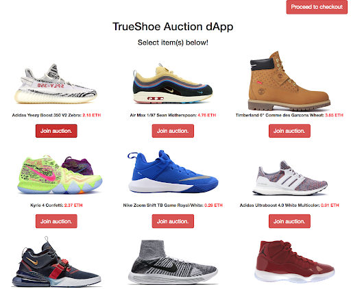
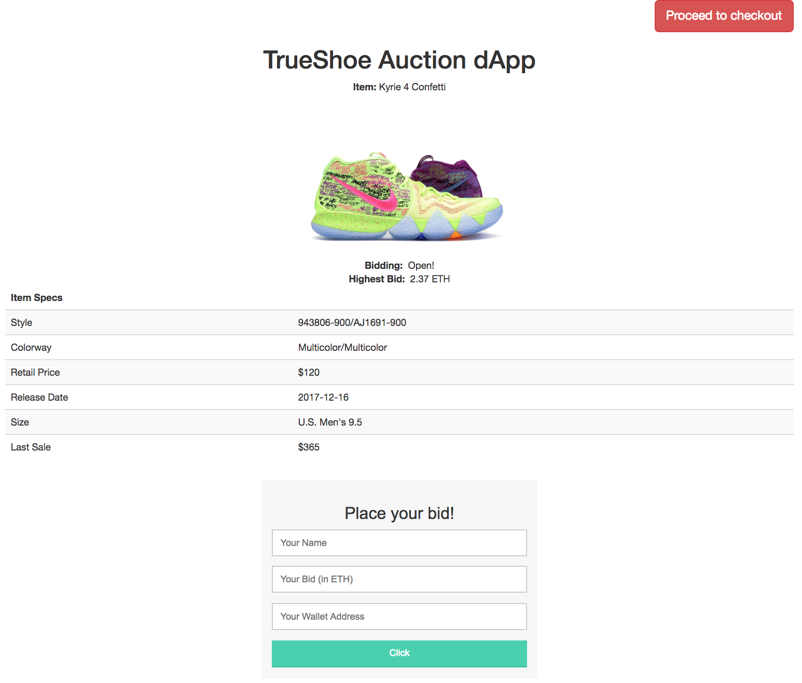
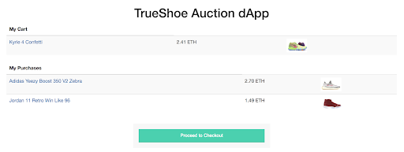

# TrueShoe: A Decentralized Platform for Sneaker Resale

This dApp demonstrates smart contract confidentiality using an auction system for purchasing the latest and greatest hype footwear. From auction to purchase to delivery, the entire customer experience is regulated by the TrueShoe platform.

## Setup and Installation

Before you begin buying and selling shoes on TrueShoe, make sure you complete the following prerequisites:

1. Set up a digital payments wallet by downloading [Metamask](https://metamask.io/)!
2. Configure your digital payments wallet to use Oasis DEV tokens by following instructions at [this link](https://docs.oasiscloud.io/en/latest/quickstart-guide/) and purchase DEV tokens from the [Oasis Labs Faucet](https://faucet.oasiscloud.io/) for a digital asset to use for participating in shoe auctions.
3. Download [Homebrew](https://brew.sh/).

Once you've setup and configured your digital wallet and downloaded Homebrew, you're ready to proceed with installation! Run the following command in your terminal to install Node.js:

```
brew install node
```
and confirm installation with `npm -v`. Then, install Truffle by running

```
npm install -f truffle
```

Once Truffle is installed, you can test the TrueShoe smart contract implementations on a local Oasis blockchain network by running

```
truffle compile
```

followed by

```
truffle migrate --network oasis
```

You can ensure that the contracts are functioning as expected by running 

```
truffle test --network oasis
```

This should pass upon initial installation, and can be used to verify that the expected behavior continues to hold after any local modifications you may choose to make to suit your purposes.

## System Architecture

Access our [system architecture overview](assets/trueshoe_arch.pdf)! Feedback is always welcome!

## Screenshots

Here are some screenshots of the TrueShoe platform.

### Listings



### Auction Details


### Order History

